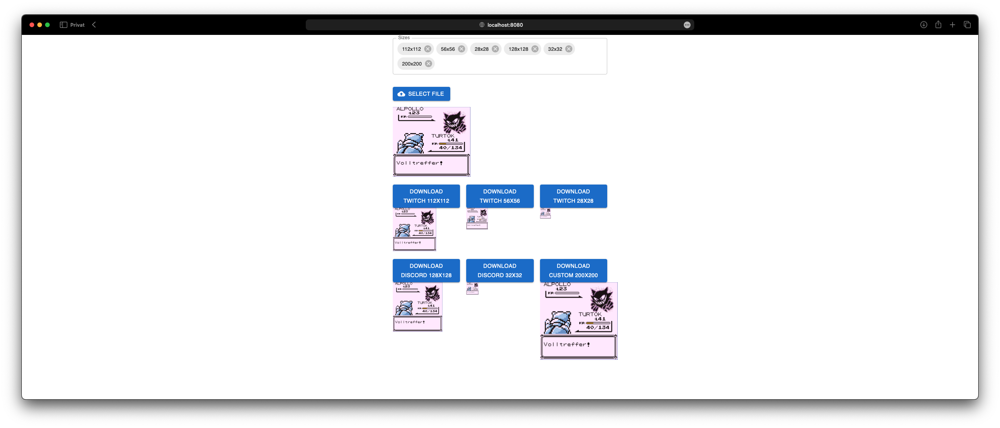

# A simple emote converter

Simply select an image and you will receive the selected image in all common emote sizes (e.g. Twitch, Discord).

All images are processed locally via Javascript, so no images are sent anywhere.

[Example (https://emote-converter.e-hess.com)](https://emote-converter.e-hess.com)

## Quick Start

### Using docker

```bash
docker run -it --rm \
    --publish 8080:80 \
    ghcr.io/eric-hess/emote-converter:latest
```

Now you can access the webpage via the following link: `http://localhost:8080`

### Using npm

1. Install dependencies:

```bash
npm install
```

2. Run the dev server:

```bash
npm run start
```

Now you can access the webpage via the following link: `http://localhost:3000`

## Docker Compose Example
[docker-compose.yml](./docker/docker-compose.yml)
```yml
services:
    emote-converter:
        image: ghcr.io/eric-hess/emote-converter:latest
        restart: unless-stopped
        ports:
            - 8080:80
```

## Screenshots

